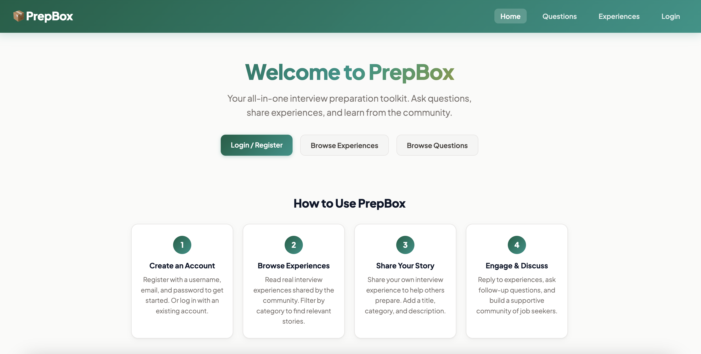
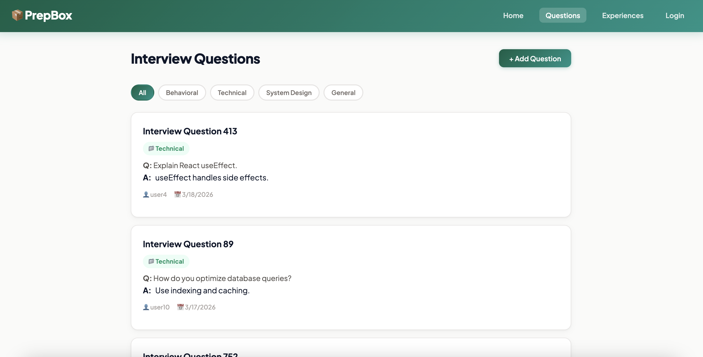
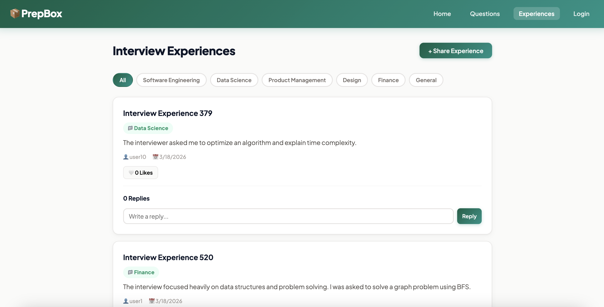
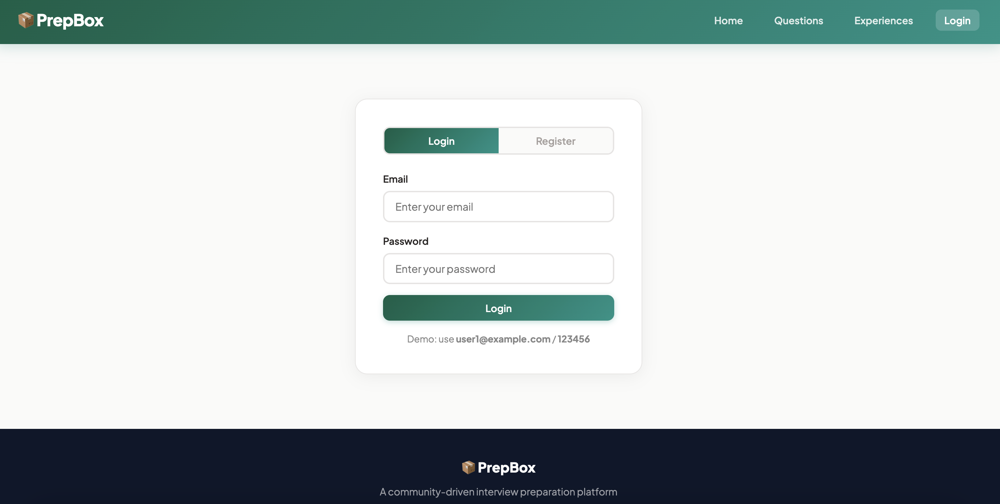

# Project 3 - PrepBox

## Overview

### Author
**Helly Niteshbhai Diyora**
diyora.h@northeastern.edu

**Lili Mei Ye** 
meiye.l@northeastern.edu

### Class Information
- [CS5610 Web Development](https://johnguerra.co/classes/webDevelopment_online_spring_2026/index.html)
- Spring 2026
- Northeastern University

### Links
- [PrepBox](https://prepbox-frontend.onrender.com/)
- [Design Document](./documents/designDocument.pdf)
- [Video Demonstration](https://youtu.be/IjTaETGWBCk?feature=shared)
- [Google Slides](./documents/prepBoxSlides.pdf)
- [Usability Study Report - Helly Diyora](https://docs.google.com/document/d/1rJ8sr1MvCV5PEqRZ-30TnZvg93BG97YEbzdeFhkEYgY/edit?usp=sharing)

## Project Objective
PrepBox is a web application designed to help students and job seekers prepare for interviews.

The goal of PrepBox is to:
- Help users practice interview questions
- Share real interview experiences
- Improve interview preparation
- Build a supportive learning community

## Technologies Used

- React
- Node.js
- Express
- MongoDB
- Vite

## Features
### Questions & Answers
- Add interview questions
- Edit and delete questions
- Browse questions by category
- Reply to questions

### Experiences & Replies
- Share interview experiences
- Edit and delete posts
- Reply to posts
- Like/unlike posts
- Filter by category

### Login & Register
Login required for:
- Creating, editing, and deleting questions
- Posting, editing, and replying posts

## Screenshots
### Home Page


### Questions Page


### Experiences Page


### Login/Register Page



## Project Structure
```
PrepBox/
├── frontend/                    # Frontend files
│ ├── pages/                     # Page-level components
│ │ ├── AuthPage.jsx             # Login/Register page
│ │ ├── Experience.jsx           # Experiences page
│ │ ├── Home.jsx                 # Home page
│ │ └── QuestionsPage.jsx        # Questions page
│ │
│ ├── src/
│ │ ├── components/              # UI components
│ │ │ ├── Navbar/                # Navigation bar
│ │ │ ├── experienceForm/        # Create/Edit experience
│ │ │ ├── experienceList/        # Experience list display
│ │ │ ├── questionForm/          # Create/Edit question
│ │ │ └── questionList/          # Question list display
│ │ │
│ │ ├── index.css                # Global styles
│ │ └── index.jsx                # React entry point
│ │
│ └── index.html                 # HTML entry file
│
├── backend/                     # Backend
│ ├── controllers/               # Business logic
│ │ ├── ExperienceController.js  # Experiences logic
│ │ ├── InterviewController.js   # Questions logic
│ │ └── authController.js        # Authentication logic
│ │
│ ├── routes/                    # API routes
│ │ ├── ExperiencePosts.js       # Experience endpoints
│ │ ├── InterviewQuestions.js    # Question endpoints
│ │ └── auth.js                  # Auth endpoints
│ │
│ ├── db/
│ │ └── mongo.js                 # MongoDB connection
│ │
│ ├── data/
│ │ └── seedData.js              # Seed script
│ │
│ ├── server.js                  # Express server entry
│ ├── package.json               # Backend dependencies
│ └── env.example                # Environment variables template
│
│
│── documents/                   # Folder to store screenshots & design document
│
├── .gitignore                   # Git ignore rules
├── LICENSE                      # MIT License
└── README.md                    # Project documentation
```

## How to Run the Project
### Prerequisites
- Node.js (v18+)
- MongoDB (local or Atlas)

### Setup

**Clone the repository**
```bash
git clone https://github.com/myinglin2333/PrepBox.git
cd PrepBox
```

**Backend**
```bash
cd backend
npm install
npm start
```

**Seed Data**
```bash
node data/seedData.js
```

**Frontend**
```bash
cd ../frontend
npm install
npm run dev
```

**Open in browser**
```bash
http://localhost:5173
```

## License
This project is licensed under the **MIT License**.

See the [MIT License](LICENSE) file for details
